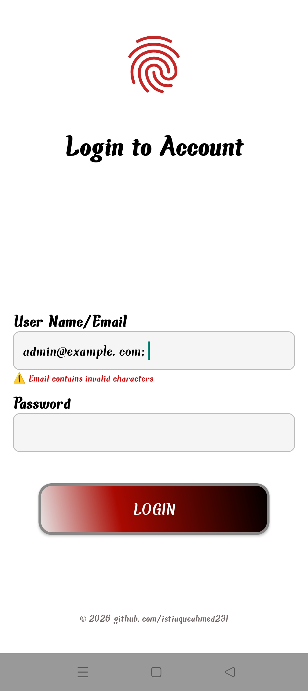
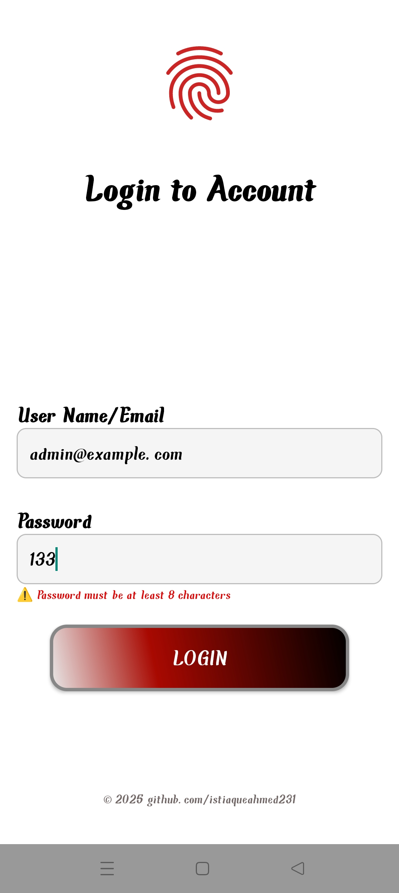
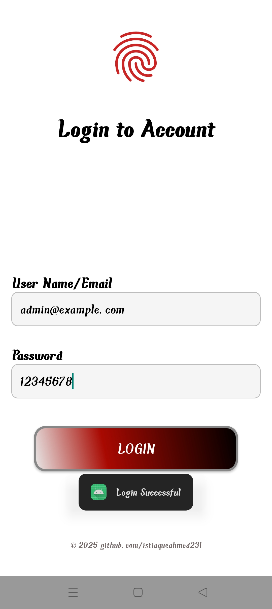
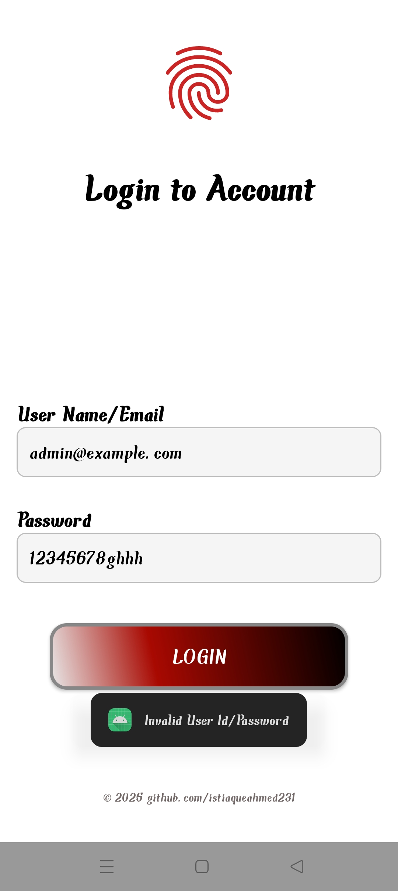

# 🔐 Android Login Page with MVVM, LiveData & ViewBinding

This is a **simple, reusable login screen** for Android apps, built using modern Android architecture components like **LiveData**, **View Binding**, and following the **MVVM (Model-View-ViewModel)** pattern.

It demonstrates how to keep the UI reactive and lifecycle-aware while ensuring clean code separation and easy reusability.

---

## 🚀 Features

- ✅ **Email and Password Validation**  
  Basic form validation to improve user input handling.

- 🔄 **Reactive UI with LiveData**  
  The UI updates automatically based on user input and logic in the ViewModel.

- 🧼 **Clean Architecture (MVVM)**  
  Separation of concerns between UI, data, and logic for better maintainability.

---

## 🌟 Benefits of LiveData & ViewBinding

- 📡 **LiveData**  
  Lifecycle-aware observable data holder. It only updates UI observers when they are active — helping prevent memory leaks and null pointer crashes.

- 🧩 **View Binding**  
  Safer alternative to `findViewById`. Provides direct and type-safe access to views, reducing boilerplate and compile-time errors.

---

## ♻️ Reusability

This login module is built to be **easily reusable** in any Android app.  
Just drop in the `MainActivity`, `LoginViewModel`, and layout XML files.

- 🔧 Minimal modification needed to integrate with your existing project.
- 🔐 The `LoginViewModel` logic can be adapted to connect with any backend or authentication service.

---

## 📷 Screenshots

Below are screenshots showcasing different states of the app — from clean UI to reactive validation:

### ✨ App UI Flow

  
  
  
  
  

---

## 🤝 Contributing

Have an idea to improve this project? Found a bug?  
Feel free to fork the repo and open a pull request!

---

⭐ If you liked this project, consider **starring** it and **sharing** with others!
